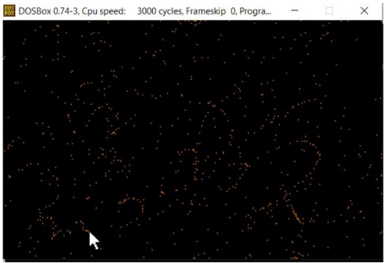

# Game of Life (Assembly 8086)

### Rules
- `Any live cell with fewer than two live neighbours dies, as if by underpopulation.
-  Any live cell with two or three live neighbours lives on to the next generation.
-  Any live cell with more than three live neighbours dies, as if by overpopulation.
-  Any dead cell with exactly three live neighbours becomes a live cell, as if by

Please reference the following link to read more about the rules:
https://en.wikipedia.org/wiki/Conway%27s_Game_of_Life?fbclid=IwAR2VbPeFDLWS0jLoL5

### Prerequisites
1. Install DOSBOX on your machine using the following link: https://www.dosbox.com/
2. Install 8086 zip file by clicking the following link:
https://drive.google.com/file/d/0B001eXddyriFbFBhclB5QmVvaVE/view
## Installing
1. Go, to your Download, click on the 8086 zip file and move the 8086 folder into your C
drive
2. Open your DOSBOX and type in the following commands:   
<pre><code>a) mount c c:/8086   </code></pre>
<pre><code>b) c:   </code></pre>
<pre><code>c) edit filename.asm   </code></pre>
<pre><code>d) Type in your assembly code here   </code></pre>
<pre><code>e) masm filename.asm   </code></pre>
<pre><code>f) Enter ;   </code></pre>
<pre><code>g) link filename   </code></pre>
<pre><code>h) Enter ;   </code></pre>
<pre><code>i) filename   </code></pre>

3. Once you are in the file ,  
  <pre><code>a) Press Enter to go from the title page (initial screen) to the screen where you can draw the initial configuration using the mouse   </code></pre>
  <pre><code> b) Right click and then drag the mouse around the screen to draw the initial configuration  
  (NOTE: make sure you fill the screen a lot to see the results).   </code></pre>
4. Following is the picture of a recommended amount of initial configuration
drawn:   

Note: If you are not satisfied with the initial condition you drew, press SPACE to reset the
screen. Once the screen is reset , draw your initial condition again.  
 <pre><code> c) Right click to make the mouse disappear.  </code></pre>
 <pre><code> d) Press any key from the keyboard to play the game  </code></pre>
 <pre><code> e) Press Esc to go to the exit page   </code></pre>
Note: User also has the ability to go from the exit screen to the screen where the user can
draw the initial configuration. The user can do so by pressing SPACE.   
Note: To exit DOSBOX, meaning get the control of your mouse outside of DOSBOX, press
Ctrl + F10    

### Build With  
- Visual Studio Code - used to write assembly code  
- DOSBOX - used to run the assembly code

## Author
Anam Munawar
